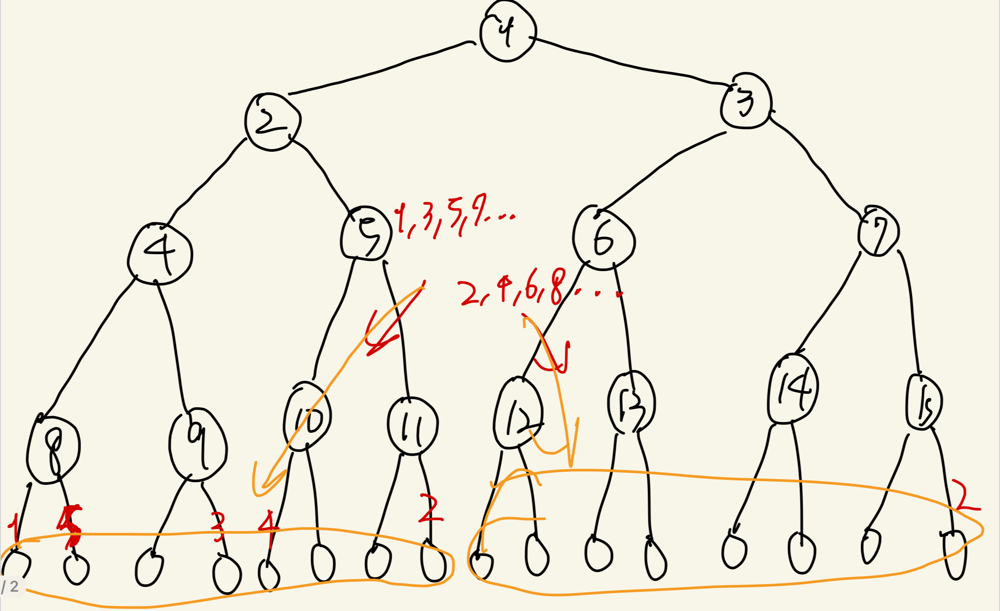

# 공 굴리기

- 시간 제한: 1초
- 메모리 제한: 128mb

루트 노드가 $1$이고, 노드의 개수가 $2^{N} - 1$인 포화 이진 트리가 있다. 트리의 $i(1 ≤ i ≤ 2^{N - 1} - 1)$번 노드의 왼쪽 자식은 $2i$번 노드, 오른쪽 자식은 $2i + 1$번 노드이다. 산지니는 이 포화 이진 트리에 공을 $2^{N} - 1$번 굴려서 각 정점마다 공을 한 개씩 배치하려고 한다. 공 굴리기 규칙은 다음과 같다.

1. 자식 노드가 존재하지 않거나 자식 노드들에 모두 공이 존재한다면, 공은 그 노드에서 정지한다.
2. 만약 두 자식 노드가 비어있다면, 각각 자식 노드를 루트 노드로 하는 두 서브 트리의 무게를 비교해서, 더 가벼운 서브 트리의 루트 노드로 공이 굴러간다. 서브 트리의 무게란, 각 서브 트리에 존재하는 공의 개수이다.
3. 만약 현재 노드가 $1$번 노드가 아니고 두 서브 트리의 무게가 동일하다면, 현재 노드가 전 노드의 오른쪽 자식일 경우 현재 노드의 오른쪽 자식을 선택하고, 전 노드의 왼쪽 자식일 경우 현재 노드의 왼쪽 자식 노드를 선택한다. 현재 노드가 $1$번 노드일 경우, 두 서브 트리의 무게가 동일할 경우 왼쪽 자식 노드를 선택한다.
4. 만약 두 자식 노드 중 하나만 비어있다면, 비어 있는 노드를 선택한다. 

—그림 예제 추가 예정—

산지니는 공을 굴리기 전, $K$번째에 공을 굴릴 때 굴린 공이 몇 번 노드에 위치하는지 미리 알고 싶어졌다. 산지니를 위해 우리가 대신 구해주자!

## 입력

첫 번째 줄에 두 정수 $N, K$가 공백으로 구분되어 주어진다.

## 출력

첫 번째 줄에 $K$번째에 공을 굴릴 때 굴린 공이 위치하는 노드의 번호를 출력한다.

## 제한

$1 ≤ N ≤ 31$

$1 ≤ K ≤ 2^{N} - 1$

## 예제 1

### 입력

```
3 2
```

### 출력

```
7
```

예상 난이도

- 골4

사용 알고리즘

- 수학
- 분할 정복

풀이

- 루트 노드에서부터 $i$번째 정점까지의 거리를 $d_i$라고 하고, 공이 채워지는 순서의 번호를 $X_i$라고 할 때, 임의의 $d_i < d_j$인 $i, j$에 대해 $X_j < X_i$임. 즉 $K$번째 공의 위치를 $t$라고 할 때, $d_t$의 값을 특정할 수 있음.
- 채워지는 순서가 서브 트리 단위로 대칭됨을 알 수 있음.


