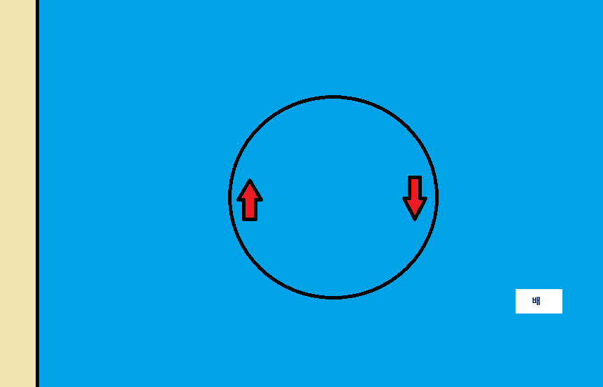

# 순환 해류

산지니는 해운대에서 배를 타다 운행을 잘못해서 바다에서 길을 잃었다. 점점 무서워진 산지니는 배를 타고 육지로 돌아가려고 했지만, 배의 연료가 얼마 남지 않았다는 사실을 알게 되었다! 산지니는 2차원 평면인 지도를 보며 곰곰히 생각하다, 바다 근처에 존재하는 하나의 순환 해류의 존재를 알게 되었다. 순환 해류에 대한 정보는 다음과 같다.

- 순환 해류란, 점 $(x, y)$를 중심으로 하고, 반지름이 $r$인 원의 둘레의 형태를 한다.
- 순환 해류 내부에서 배를 시계 방향으로 운행할 때 또는 방향을 변경할 때 연료를 소비하지 않는다. 단, 둘레 안은 순환 해류가 아니므로 내부에서 이동할 연료를 소비하지 않으며, 순환 해류의 시계 방향으로의 운행은 불가능하다.
- 순환 해류는 들어올 때와 나갈 때 추가로 연료를 소비하지 않으며, 나갈 때는 어느 방향으로도 나갈 수 있다. 
- 순환 해류는 육지에서 흐르지 않으며, 순환 해류 내부가 아닐 경우 $k$만큼 이동할 때 연료를 $k$리터 소비한다. 연료가 $0$리터일때, 배는 움직일 수 없다.

육지의 위치는 $x ≤ 0$인 평면이다. 순환 해류와 배의 위치, 배의 연료량이 주어졌을 때, 산지니는 주어진 연료로 육지로 돌아갈 수 있을 지 계산해보자.

## 입력

첫 번째 줄에 순환 해류의 정보 $x, y, r( 0 < x ≤ 10,000, -10,000 ≤ y ≤ 10,000, r < x)$이 들어온다.

두 번째 줄에 배의 위치 $px, py(0 < px ≤ 10000, -10,000 ≤ py ≤ 10,000)$와 남은 연료량 $G(1 ≤ G ≤ 20000)$가 주어진다.

입력에 주어지는 모든 수는 정수이다.

## 출력

첫 번째 줄에 주어진 연료로 육지에 도달할 수 있으면 YES를, 도달할 수 없으면 NO를 출력한다.

## 풀이

- 기하학
- 순환 해류를 타지 않을 때 최적해가 존재할 수 있음을 유의
